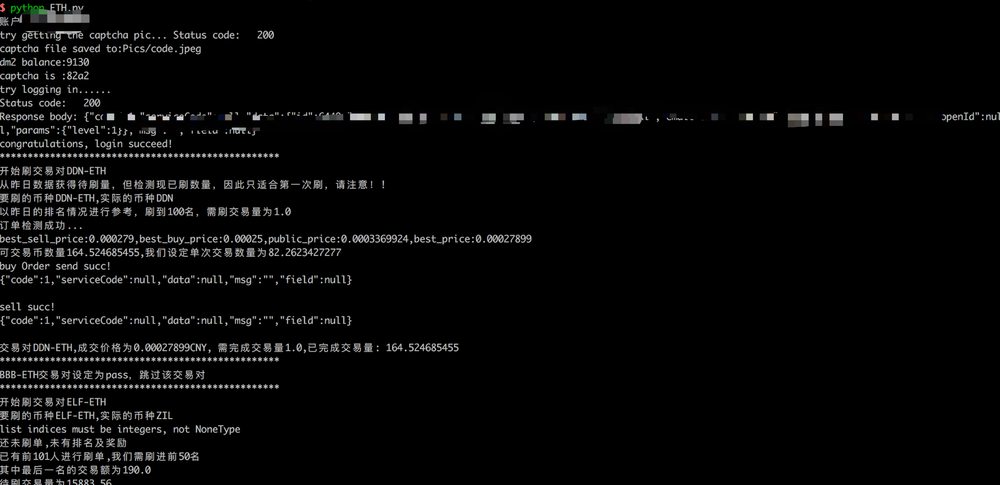

# BBAEX 自动化套利

## 现有功能

1. 依据conf目录自动配置数据
2. 自建Web API提高价格访问延迟
3. 脚本自动刷ETH交易对，单线程版（价格、单次数量、总数量均自动获取、带安全模式）
4. 自动刷CNY交易对，协程版（价格、单次数量、总数量均自动获取、带安全模式）
5. 币种转移功能（使用C2C转移，协程版）

> 优化：
>
> 1. 计算最佳收益点，亏损则不刷，非精确。
> 2. 交易量计算累加上转币所占的交易量，防止刷单排行超出原有排行名次。
> 3. 增添单独全账号转币操作，适用于一些不需要刷很高交易量的情况

# Usage

首先，保证账号在对应IP地址上登录过，因为每次换IP登陆都需要短信验证码，这一部分当下脚本未做到。验证码识别已自动化。

所有的重要信息均会打印到文件，文件在data里面，以UID+XXX.log命名。详细信息则显示在console里。所有脚本若刷到一半不想刷了，请使用ctrl+C退出，这样程序会自动捕捉信号，做撤单处理，进行安全退出。尤其C2C和Transfer脚本的Ctrl+C退出处理需要一段时间，请务必等待，不要直接关闭！！

### base.json


最开始配置base.json文件，整个文件编写必须符合json规范，英文撰写！

### ETH.py

```
{
	"uid":"6449",
	"Trades":
	[
		{
			"trade":"DDN-ETH",
			"rank":"100",
			"yesterday":"1",
			"pass":"0"
		},
		{
			"trade":"BBB-ETH",
			"rank":"50",
			"yesterday":"1",
			"pass":"1"
		},
		{
			"trade":"ELF-ETH",
			"rank":"50",
			"yesterday":"0",
			"pass":"0"
		}
	]
}
```

配置eth.json即可。uid为对应用户的id信息，trade为你要刷的trade交易对，rank是指你要刷到第几名，yeterday为1表示使用昨日的离线数据，离线数据保存在data内，每日12点定时从服务器抓去。yeterday为0，表示使用实时数据，程序会实时抓取BBAEX交易所排名计算交易量。pass为1表示跳过该交易对，pass为0则不跳过。

上述配置，DDN-ETH使用昨日数据，刷到前100名，不pass。BBB-ETH使用昨日数据，刷到前50名，但会跳过，即程序不会刷BBB-ETH交易对。ELF则使用实时数据，刷到前50名

PS: 当前ETH.py没有使用多线程，速度会比较慢。



### C2C.py

```
{
	"uid":"6449",
	"Trades":
	[
		{
			"trade":"EOS-CNY",
			"rank":"50",
			"yesterday":"1",
			"pass":"0"
		},
		{
			"trade":"BBB-CNY",
			"rank":"50",
			"yesterday":"1",
			"pass":"0"
		},
		{
			"trade":"ELF-CNY",
			"rank":"50",
			"yesterday":"1",
			"pass":"0"
		},
		{
			"trade":"ETH-CNY",
			"rank":"50",
			"yesterday":"1",
			"pass":"0"
		}
	]
}
```

所有配置逻辑与之前一样，参考即可。


### Trans.py

```
{
	"UIDS":[6453,6449],
	"Trades":
	[
		{
			"trade":"BBB-CNY",
			"pass":"0"
		},
		{
			"trade":"DDN-CNY",
			"pass":"0"
		},
		{
			"trade":"ETH-CNY",
			"pass":"0"
		},
		{
			"trade":"ELF-CNY",
			"pass":"0"
		},
		{
			"trade":"LINK-CNY",
			"pass":"0"
		},
		{
			"trade":"LRC-CNY",
			"pass":"0"
		}
	]
}
```

trade和pass的意思与之前的一样，UIDS是指要转移的UID，从第一个UID转移到第二个UID，这里就是从6453转移到6449.


### Security.py

该脚本为补丁脚本，为了防止C2C不稳定使用的，其使用了C2C.json文件。所有配置一样。只是运行Security.py时会自动撤销对应UID的所有挂单，防止币损失。

### c2c_all.py

该脚本为自动化全账号刷单脚本,需配置c2c_all.json和now.json

```json
{
	"UIDS":["6449","7898","1111"],
	"Trades":
	[
		{
			"trade":"BBB-CNY",
			"rank":"90",
			"yesterday":"0",
			"pass":"0"
		},
		{
			"trade":"LINK-CNY",
			"rank":"90",
			"yesterday":"0",
			"pass":"1"
		}
		
	]
}
```

Trades配置与之前相同，UIDS配置为一个列表。

now.json如下：

```json
{"now": "6449"}
```

now.json用于定位。

正常情况，程序会从UIDS中获取列表，然后从now.json中获取当前位置。此时在6449位置，那么就开始刷6449的C2C交易对，刷完自动转币到7898，然后刷7898的C2C交易对，以此类推直到最后一个元素。这里当刷完1111账号的C2C时，程序便会停止，不会自动转币到第一个账户，这里请注意！

然后，now.json主要用于保存中间状态,记录现在刷到第几个账户。在ctrl+C或者异常退出时，now.json记录了当时刷的账号信息。

下次重启时，程序会自动从now.json中获取当前状态，然后继续刷交易对。

### Tools

```python
# coding:utf-8
import lib.coinInfo as coinInfo
import argparse
import sys

uuids = ['6449', '6449', '7895', '7896', '7898', '6453', '6506']

trade_list = ['CXC-ETH', 'POE-CNY']

rank = 50

is_yestoday = False
```
使用前请配置以上几个参数，参数的解释如下：

- uuids: 列表，保存所有账户的uid；monitor、out_rank功能需要指定该参数
- trade_list: 列表，用于保存需要进行操作的交易对信息；trade_count、out_rank、profit_rank这几个功能需要指定该参数
- rank： 整数，保存需要查询的排名；trade_count功能需要指定该参数


功能及使用方式：
- trade_count,查看trade_list中指定交易对在rank参数指定排名的交易量，[参数：trade, rank],`python Tool.py --trade_count`
- monitor,查看今日收益,[参数：uuids]，使用方式 `python Tool.py --monitor`
- out_rank,获取uuids中的账号在trade_list交易对中的落榜信息,[参数：uuids, trade_list]，使用方式 `python Tool.py --out_rank`
- profit_rank,计算trade_list交易对的排行榜收益前十,[参数：trade]，使用方式 `python Tool.py --profit_rank`

以上的功能可以额外使用-y参将数据源从实时数据切换为昨日的数据，示例如下：
- 统计昨日的收益 `python Tool.py --monitor -y`

下面的功能不能使用-y参数：
- 保存今日的排行榜信息， `python Tool.py --save_json`


### Web API系统
- 目前自搭建的实时价格Web API已开始使用，主要修改了lib/price.py中Coinmarketcap类的实现，数据源从阿里云服务器上的flask webapi中获取，但是调用方法不变。
- 阿里云服务器上运行flask+redis，通过异步的方式，在接受请求的同时刷新价格。不接受请求时，服务器上通过crontab每分钟执行手动renew价格的脚本来更新redis数据库。


### 下一步工作

1. 重构ETH.py 

   1. 用log替代print；尝试多线程；

2. Web API部分交易对不充分需要补充

   ```python
   def get_public_price(trade):
       if trade=='DDN-CNY': 
           price = 2.0
       elif trade=='DDN-ETH':
           price = 0.00031203
       elif trade =='ETH-CNY':
           price = 5000
       else:
           data = trade.split('-')
           import price
           coinmarketcap = price.Coinmarketcap()
           price = coinmarketcap.getSymbolPrice(data[0])
       return price*1.08
   ```

   

3. 自动截胡系统 

   
   高频监控买卖单（快速获取），快速获得买卖单信息。
   设定价格区间，假设ETH，设定上区间为5500，下区间为5000.
   一旦，获取到买一价格大于5500，立即挂卖单，卖出
   同理，获取到卖一价格小于5000，立即挂买单买入。
   


